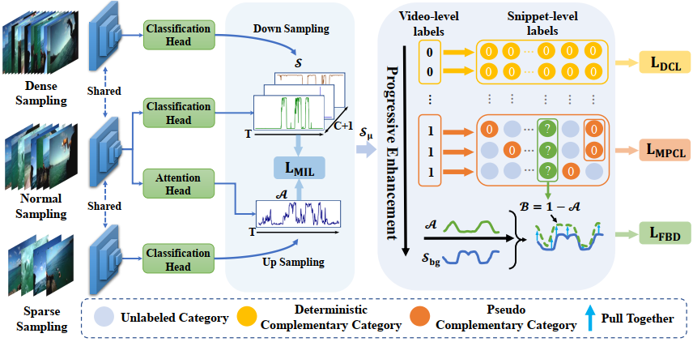

# <p align="center">Weakly-Supervised Temporal Action Localization by Progressive Complementary Learning</p>

### <p align="center">*Jia-Run Du, Jia-Chang Feng, Kun-Yu Lin, Fa-Ting Hong, Zhongang Qi, Ying Shan, Jian-Fang Hu, and Wei-Shi Zheng*</p>

#### <p align="center">[[Paper]](https://arxiv.org/abs/2206.11011) </p>

Official repository of TCSVT 2024 paper "Weakly-Supervised Temporal Action Localization by Progressive Complementary Learning".



> We propose a Progressive Complementary Learning (ProCL) method that progressively enhances the snippet-level supervision from the perspective of category exclusion. Specifically, our ProCL gradually excludes the categories that snippets should not belong to, based on different confidence levels. Moreover, we propose three snippet-level
losses for weakly-supervised temporal action localization, bridging the gap between video-level supervision and unavailable snippet-level supervision, without using additional auxiliary models or information. 


## 💬 News
- [2024.10.09] 🎊 The ckpts of ProCL are available.
- [2024.10.09] 🥳 Code of ProCL is released. 
- [2024.09.03] 🎉 Our work is accepted by TCSVT 2024. 


## 🔧 Requirements
- Python 3.6 and Pytorch 1.3.0 are used.
- We conduct the environments on a **single 1080Ti** GPU.
- Create the anaconda environment as what we used, as bellow:
```shell
conda env create -f environment.yaml
```

## 📕 Prepare the data
- The features for [`[Thumos14]`](https://pan.baidu.com/s/10HgDyo7eJqM-9E__0ev2YA?pwd=txk7) and [`[ActivityNet1.3]`](https://pan.baidu.com/s/1ocyQasxBlad1UKgLU-hgKg?pwd=pvwo) dataset can be downloaded. The annotations are included with this package.
- After downloading, modify the config `--path-dataset` in your running script to your own path.

## 👀 Quick Start
- Download the pre-trained [`[checkpoints]`](https://pan.baidu.com/s/1kFVQSM0op-wTPISd7f7VKg?pwd=qisw).
- Create the default folder **./ckpt** and put the downloaded pre-trained models into **./ckpt**.
- Run the test scripts:
```shell
# Thumos14
CUDA_VISIBLE_DEVICES=2 python test.py --use-model Model_Thumos --dataset-name Thumos14reduced --path-dataset /mnt/Datasets/TAL_dataset/Thumos14 --model-name Train_Thumos14 --seed 355 --delta 0.2 --max_seqlen_list 560 1120 280 --att_thresh_params 0.1 0.925 0.025 --test_proposal_method 'multiple_threshold_hamnet_v3' --test_proposal_mode 'att' --PLG_logits_mode 'norm' --PLG_thres 0.69

# ActivityNet1.3
CUDA_VISIBLE_DEVICES=2 python test.py --use-model Model_Ant --dataset-name ActivityNet1.3 --path-dataset /mnt/Datasets/TAL_dataset/ActivityNet1.3/  --dataset Ant13_SampleDataset --model-name Train_ActivityNet13 --num-class 200 --seed 3552 --delta 0.3 --t 10 --max_seqlen_list 90 180 50 --test_proposal_method 'multiple_threshold_hamnet_ant' --PLG_logits_mode 'norm' --PLG_thres 0.685
```

## 🏷️ Train Your Own Model
- Thumos14
```shell
CUDA_VISIBLE_DEVICES=2 python main.py --use-model Model_Thumos --dataset-name Thumos14reduced --path-dataset /mnt/Datasets/TAL_dataset/Thumos14 --model-name Train_Thumos14 --seed 355 --delta 0.2 --max_seqlen_list 560 1120 280 --use_ms --k 7 --max-iter 20000 --att_thresh_params 0.1 0.925 0.025 --test_proposal_method 'multiple_threshold_hamnet_v3' --test_proposal_mode 'att' --lambda_cll 1 --lambda_lpl 1 --PLG_logits_mode 'norm' --PLG_thres 0.69 --rescale_mode 'nearest' --ensemble_weight 0.33 0.33 0.33 --lpl_norm 'none' --alpha 0 --multi_back --lambda_mscl 1 --SCL_alpha 1 --pseudo_iter -1 --interval 50
```

- ActivityNet1.3
```shell
CUDA_VISIBLE_DEVICES=2 python main.py --use-model Model_Ant --path-dataset /mnt/Datasets/TAL_dataset/ActivityNet1.3/ --dataset-name ActivityNet1.3 --dataset Ant13_SampleDataset --model-name Train_ActivityNet13 --num-class 200 --seed 3552 --delta 0.3 --t 10 --max_seqlen_list 90 180 50 --use_ms --k 10 --lr 1e-5 --max-iter 30000 --test_proposal_method 'multiple_threshold_hamnet_ant' --lambda_cll 1 --lambda_lpl 1 --PLG_logits_mode 'norm' --PLG_thres 0.685 --rescale_mode 'nearest' --ensemble_weight 0.33 0.33 0.33 --lpl_norm 'none' --alpha 1 --multi_back --pseudo_iter 20000
```


## Acknowledgement
We would like to thank the contributors to the [CO2-Net](https://github.com/harlanhong/MM2021-CO2-Net), [ASM-Loc](https://github.com/boheumd/ASM-Loc) for their open research and exploration.


## 📝 Citation

If you find ProCL useful for your research and applications, please cite using this BibTeX:

```bibtex
@article{du2024weakly,
  title={Weakly-supervised temporal action localization by progressive complementary learning},
  author={Du, Jia-Run and Feng, Jia-Chang and Lin, Kun-Yu and Hong, Fa-Ting and Qi, Zhongang and Shan, Ying and Hu, Jian-Fang and Zheng, Wei-Shi},
  journal={IEEE Transactions on Circuits and Systems for Video Technology},
  year={2024},
  publisher={IEEE}
}
```